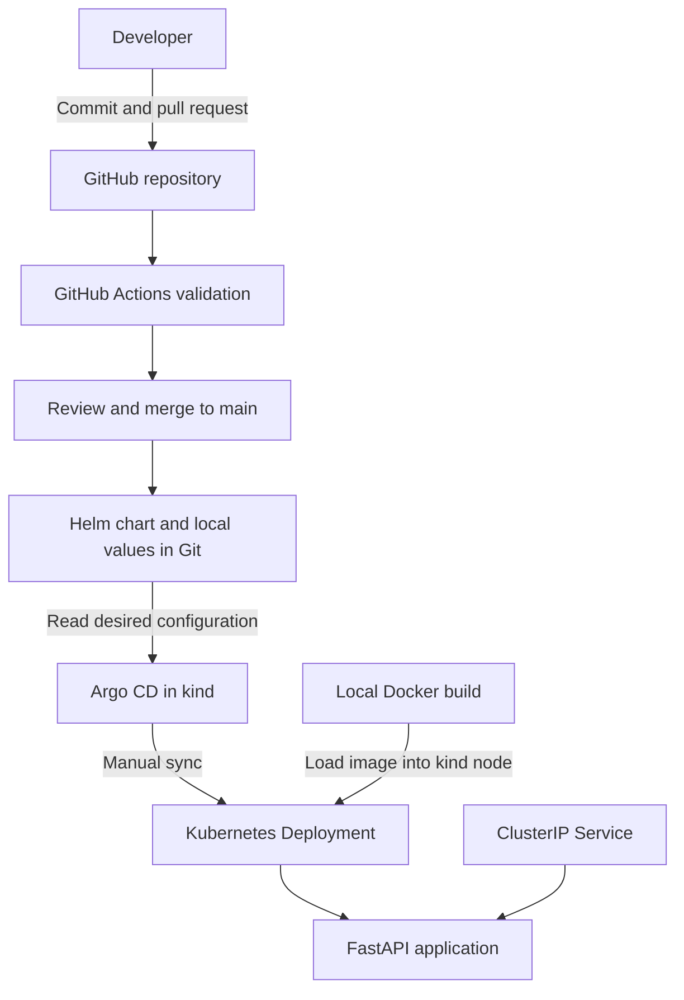
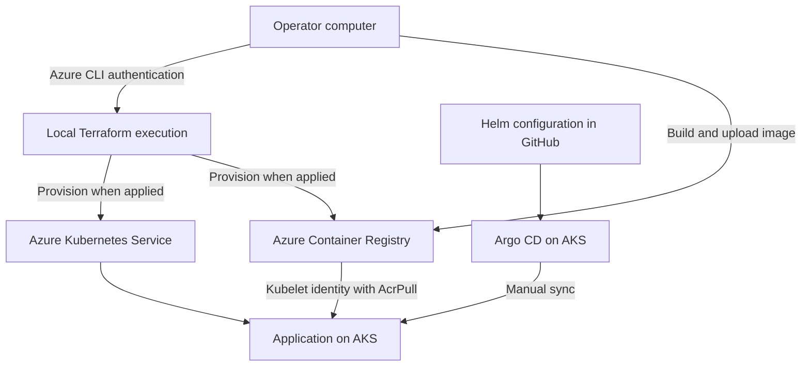

# Azure AKS GitOps Platform

Kubernetes and GitOps portfolio project built with Terraform, Docker, Helm, Argo CD, and GitHub Actions.

The project demonstrates how application code, container security, declarative deployment, and infrastructure configuration fit together. A small FastAPI service provides a version endpoint and health checks, making deployment changes and rollbacks observable.

The application delivery workflow was validated locally in kind, including manual Argo CD synchronization, a version rollout, a Git-revert rollback, and security checks. Azure infrastructure is defined in Terraform and verified through a successful Azure-authenticated plan.

## Project status

| Area | Result |
| --- | --- |
| Application and container | Built and tested locally and in CI |
| Kubernetes and Helm | Deployed and validated in kind |
| Argo CD | Manual synchronization reached Synced and Healthy |
| Release recovery | Version change and Git-revert rollback verified |
| Runtime security | Container restrictions, application NetworkPolicy, and reduced Argo CD permissions tested locally |
| CI | Four jobs passed through the pull request workflow |
| Azure infrastructure | Terraform formatting, schema validation, and authenticated plan succeeded |

The completed project combines a tested local GitOps workflow with Azure infrastructure planning. Runtime validation was performed in kind; the Azure scope covers configuration validation and an authenticated Terraform plan, without an AKS deployment. Configuration and recorded evidence are preserved for reconstruction.

## Architecture

### Validated local deployment



GitHub Actions validates changes. Argo CD reads the merged configuration and renders the Helm chart inside the cluster. Deployment uses an explicit manual synchronization after CI and review, keeping validation and release approval as distinct steps.

Container images are built locally and loaded into kind. The local values use `imagePullPolicy: Never`, avoiding an external registry dependency for this validation path.

### Azure infrastructure design



The Azure design uses local Terraform execution and the operator's Azure CLI identity. ACR supplies the application image, and Argo CD applies the desired Helm configuration from Git. Infrastructure access and application reconciliation have separate responsibilities.

## Technology stack

| Component | Technology and purpose |
| --- | --- |
| Application | Python 3.13, FastAPI, and Uvicorn |
| Container | Docker multi-stage build with an Alpine runtime |
| Local Kubernetes | kind with Docker Desktop |
| Deployment packaging | Helm chart with environment-specific values |
| GitOps | Argo CD with manual synchronization |
| Continuous integration | GitHub Actions |
| Image vulnerability scanning | Trivy |
| Secret detection | Gitleaks |
| Azure infrastructure | Terraform with the AzureRM provider |
| Azure platform design | AKS, ACR, managed identities, and Azure RBAC |
| Development tooling | Git, PowerShell, VS Code, and ChatGPT Codex |

The recorded local validation used Kubernetes 1.37.0 and Argo CD 3.5.3. The successful Azure plan selected Kubernetes 1.36.3. The validation records capture the versions used for each environment.

## Application

The application exposes three HTTP endpoints on port `8000`:

| Endpoint | Example response | Purpose |
| --- | --- | --- |
| `GET /version` | `{"version":"0.1.0"}` | Observe the configured application version |
| `GET /health/live` | `{"status":"alive"}` | Kubernetes liveness and startup checks |
| `GET /health/ready` | `{"status":"ready"}` | Kubernetes readiness checks |

`APP_VERSION` controls the version response and defaults to `0.1.0`. The Helm chart supplies it through `appVersion`.

The health endpoints support process-level startup, liveness, and readiness checks. The focused application makes version changes, rollout behavior, and platform controls easy to observe.

## Container design

The Dockerfile uses a separate dependency-installation stage and an official Python Alpine runtime pinned by image digest. Binary wheels are installed and checked for dependency compatibility before being copied into the runtime image.

The runtime:

- Executes as UID/GID `10001`.
- Applies available Alpine package updates during the build.
- Removes pip after dependency installation.
- Copies application code and required dependencies, with tests excluded from the production build context.

CI tests the application with a read-only root filesystem, no external network, all Linux capabilities dropped, and privilege escalation disabled. The Kubernetes chart applies corresponding runtime restrictions.

The Alpine image passed the strict HIGH/CRITICAL scan during validation. The runtime was selected through a documented comparison of image candidates while retaining the same security gate. Build details, dependency reproducibility considerations, and dated scan results are recorded in [CI documentation](docs/ci.md).

## Kubernetes and Helm

The chart defines a Deployment, ClusterIP Service, ServiceAccount, and optional NetworkPolicy. It includes:

- Startup, liveness, and readiness probes.
- CPU and memory requests and limits.
- Non-root execution and RuntimeDefault seccomp.
- Read-only root filesystem, no privilege escalation, and all capabilities dropped.
- Disabled automatic ServiceAccount token mounting.
- Image, replica count, application version, and policy configuration through values.

`environments/local/values.yaml` selects the locally loaded image and enables the application NetworkPolicy. The earlier raw Kubernetes manifests document the initial deployment stage. Argo CD is the application resource manager for the GitOps workflow.

Helm packages the desired resources, and Argo CD renders and applies them. Git revisions provide the release history for this workflow.

## GitOps workflow and rollback

Application configuration changes follow this sequence:

```text
Feature branch
    -> Pull request
    -> Four CI jobs
    -> Review and merge
    -> Argo CD refresh and diff review
    -> Manual synchronization
    -> Rollout and endpoint verification
```

Manual synchronization is a deliberate release control: changes are inspected before deployment, while Git remains the source of desired application configuration.

A complete configuration update and rollback were exercised:

| Stage | Git revision | Observed application version |
| --- | --- | --- |
| Alpine image deployed | `7a61caf` | `0.1.0` |
| Local version override merged and synced | `233b457` | `0.1.1` |
| Git revert merged and synced | `27d33d7` | `0.1.0` |

Each synchronization completed successfully, with Argo CD reporting Synced and Healthy and the resulting application pod ready. All three endpoints returned the expected responses.

The rollback preserved Git history and restored the previous application version through a reviewed configuration revert using the same image. Recorded revisions, endpoint results, and the scope of the exercise are available in [GitOps validation](docs/gitops-validation.md).

## CI and security gates

`.github/workflows/ci.yaml` runs on pull requests and pushes to `main`.

| Job | Checks |
| --- | --- |
| Application and image | Docker build, HTTP tests with default and custom application versions, strict Trivy image scan |
| Helm chart | Checksum-verified Helm installation, linting, and rendering with default and local values |
| Secret scan | Gitleaks checks of fetched Git history and working files, with redacted output |
| Terraform validation | Formatting, locked provider initialization with backend disabled, and configuration validation |

HIGH and CRITICAL image findings fail CI, including findings without a published fix. No vulnerability ignore list or failure suppression is configured. Trivy scans an exported image archive without access to the Docker socket.

Actions are pinned to commit SHAs, scanner images to digests, and the Helm download to a checksum. Workflow permissions are limited to `contents: read`, and checkout does not persist credentials.

CI is dedicated to validation; Terraform infrastructure operations use the local execution workflow. GitHub branch protection or rulesets can enforce the checks before merging.

## Runtime security

### Application traffic

The local NetworkPolicy allows inbound TCP `8000` from same-namespace pods labelled `access: demo-app` and denies new outbound connections from application pods. This matches the demo's lack of external dependencies.

Local validation confirmed the intended traffic behavior: a labelled client reached the application, an unlabelled client was blocked, and application access to the Kubernetes API service was denied. The policy uses namespace and pod-label selectors.

### Argo CD permissions

A local RBAC overlay limits application-controller workload writes to the `demo-app` namespace. The Argo CD server receives application inspection and pod-log access there. The AppProject restricts the repository, destination, and allowed resource types.

Authorization checks confirmed expected application operations and rejected the tested access to unrelated namespaces, role-binding creation, and secrets. Argo CD retains the permissions needed for its own configuration and application reconciliation.

The [security validation record](docs/local-security.md) documents exact checks, bootstrap commands, and their scope.

## Azure infrastructure and planning

Terraform defines a dedicated project resource group, AKS, ACR Basic, and three role assignments. AKS additionally manages its node resource group and supporting compute/network resources.

The Terraform configuration includes:

- AKS Free cluster-management tier and a fixed two-node system pool.
- Entra authentication and Azure Kubernetes RBAC.
- Disabled local cluster accounts and AKS Run Command.
- Public Kubernetes API access limited to explicit operator IPv4 `/32` addresses.
- Managed control-plane and kubelet identities, with registry-scoped AcrPull.
- ACR admin credentials disabled.
- Azure CNI overlay with Cilium.
- AKS OIDC issuer and workload identity enabled independently of GitHub authentication.

On **2026-10-02**, the Azure-authenticated Terraform plan completed successfully:

```text
Region:             West Europe
Kubernetes:         1.36.3
System nodes:       2 x Standard_E4bs_v5
Registry tier:      Basic
Terraform actions:  6 to add, 0 to change, 0 to destroy
```

The reusable configuration defaults to `Standard_D4s_v5`. The actual plan used `Standard_E4bs_v5` because the selected subscription had no DSv5-family quota. Regional quota, SKU restrictions, provider registrations, and version availability were checked before planning.

The plan provides a concrete preview of the infrastructure and role assignments using the selected Azure identity. Operator access is scoped to the project cluster, and the kubelet's image-pull role is scoped to ACR. The detailed runbook describes permissions and deployment checks.

Terraform inputs, state, kubeconfig, and saved plans remain outside Git. The saved plan was removed after review, and Azure CLI was signed out. The [Azure workflow and infrastructure runbook](docs/azure-workflow.md) documents planning, permissions, and cleanup.

## Cost and cleanup decisions

The project uses local kind validation to exercise delivery without maintaining a cloud cluster. Any future Azure test should be temporary and end with verified destruction of both the project and node resource groups.

AKS Free means no cluster-management fee; VMs, managed disks, ACR, public IPs, load balancing, and network usage can still incur charges. The `CleanupDeadline` tag records an intended cleanup time and does not trigger deletion.

A single system pool keeps the temporary Azure configuration smaller. Separating application workloads into a user pool would be a production design consideration, alongside availability, identity, observability, and recovery requirements.

After local validation, the kind cluster, project application images, temporary investigation files, and saved Terraform plan were removed. Docker Desktop was stopped. Repository source and validation documentation were preserved.

## Repository structure

```text
azure-aks-gitops-platform/
|-- .github/workflows/ci.yaml     # Four CI jobs
|-- app/main.py                  # FastAPI demo service
|-- charts/demo-app/              # Helm chart
|-- environments/local/          # Local values and initial manifests
|-- gitops/local/                # Argo CD Application, project, and RBAC
|-- infrastructure/azure/        # Terraform configuration and example inputs
|-- tests/test_endpoints.py      # HTTP tests against the container
|-- docs/                       # Validation evidence and operational notes
|-- Dockerfile
|-- requirements.txt
`-- README.md
```

## Reproduce the project

Prerequisites for local validation are Docker, kind, kubectl, and Helm. Terraform and Azure CLI are needed only for the optional Azure path. The recorded environment used Windows and PowerShell.

For a quick container check from the repository root:

```powershell
docker build --pull --tag demo-app:ci .
$ciTestsDirectory = Join-Path (Get-Location).Path 'tests'
docker run --rm --network none --read-only --cap-drop ALL --security-opt no-new-privileges --mount "type=bind,source=$ciTestsDirectory,target=/tests,readonly" --entrypoint python demo-app:ci -m unittest discover -s /tests -v
```

These commands rebuild and test an image locally; they do not deploy Kubernetes or Azure resources. For full reconstruction, follow the [local Kubernetes, Helm, and Argo CD setup](docs/local-setup.md) and [security overlay](docs/local-security.md). Use a new image tag for a new source build rather than reassigning a recorded historical tag.

For Terraform validation without Azure deployment:

```powershell
terraform '-chdir=infrastructure/azure' init -backend=false -lockfile=readonly
terraform '-chdir=infrastructure/azure' fmt -check
terraform '-chdir=infrastructure/azure' validate
```

Provider downloads require network access. Azure planning and deployment require separate local authentication and reviewed inputs. Never reuse an old plan or cleanup deadline without checking the current configuration and environment.

## Development approach and tooling

Developed collaboratively with OpenAI Codex as a tool for implementation, troubleshooting, and documentation, with project decisions, Azure planning, and pull request review led by the project author.

## Optional extensions

The completed scope focuses on local application delivery, security validation, and Azure infrastructure planning. Possible extensions include:

- A temporary AKS deployment with ACR image publishing and runtime validation.
- Prometheus/Grafana metrics, HTTP latency and availability probes, and a tested alert.
- Fully locked transitive Python dependencies and additional configuration scanning.
- An automated image-publishing workflow with separately reviewed GitHub OIDC permissions.

The existing health endpoints and Kubernetes probes provide a foundation for future metrics and alerting.
